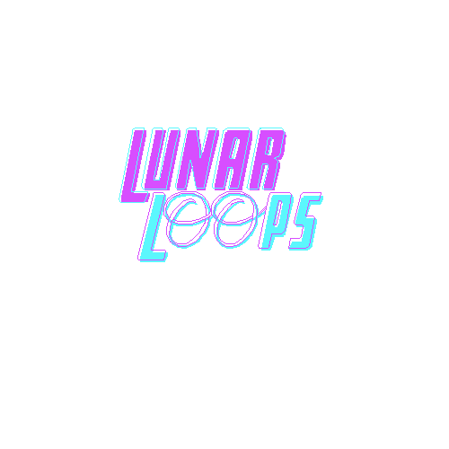

  
A 2D game inspired by the Github Game Off 2020 theme —— 'Moonshot'.  
The player controls the launch of a spaceship which must rely on the gravity of surrounding planets to land on the nearest moon.  
 
Created with the Godot game engine and self-made pixel art.  
Current version can be played at https://caitlingenna.github.io/LunarLoops/  
Many more levels and improvements to come!

